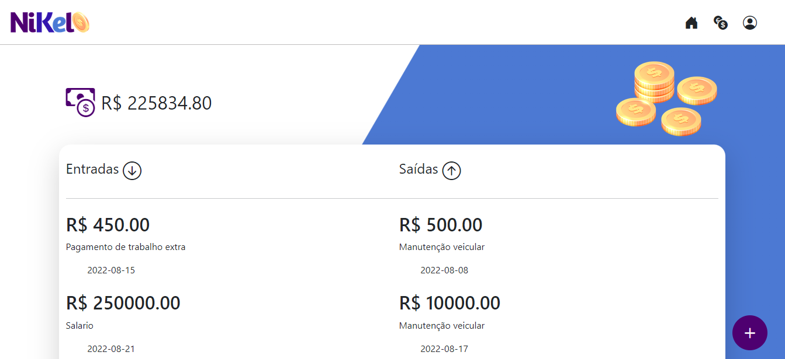

# Projeto Growdev Nikel

Projeto desenvolvido para o curso Grodev, nele é possível gerenciar suas finanças. 

##  ✔️ Telas

---

---

---
## 🤖 Tecnologias Utilizadas.

- HTML5 
- CSS3
- JavaScript 
- Bootstrap
- Node.js
- Git
- GitHub
